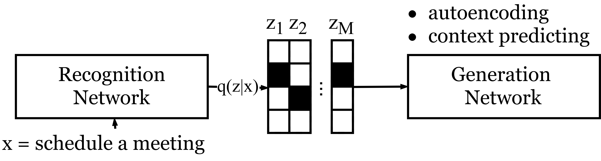

# Interpretable Neural Dialog Generation via Discrete Sentence Representation Learning
Codebase for [Unsupervised Discrete Sentence Representation Learning for Interpretable Neural Dialog Generation](https://arxiv.org/abs/1804.08069), published as a long paper in ACL 2018. You can find my presentation slides [here](https://www.cs.cmu.edu/~tianchez/data/ACL2018-talk.pdf).

  

If you use any source codes or datasets included in this toolkit in your
work, please cite the following paper. The bibtex are listed below:
 
    @article{zhao2018unsupervised,
      title={Unsupervised Discrete Sentence Representation Learning for Interpretable Neural Dialog Generation},
      author={Zhao, Tiancheng and Lee, Kyusong and Eskenazi, Maxine},
      journal={arXiv preprint arXiv:1804.08069},
      year={2018}
    }

## Requirements
    python 2.7
    pytorch >= 0.3.0.post4
    numpy
    nltk

## Datasets
The *data* folder contains three datasets:
- [PennTree Bank](https://github.com/townie/PTB-dataset-from-Tomas-Mikolov-s-webpage/tree/master/data): sentence data
- [Daily Dialog](https://arxiv.org/abs/1710.03957): human-human open domain chatting.
- [Stanford Multi-domain Dialog](https://nlp.stanford.edu/blog/a-new-multi-turn-multi-domain-task-oriented-dialogue-dataset/): human-woz task-oriented dialogs.

## Run Models
The first two scripts are sentence models (DI-VAE/DI-VST) that learn discrete sentence representations from either auto-encoding or context-predicting.

#### Discrete Info Variational Autoencoder (DI-VAE)
The following command will train a DI-VAE on the PTB dataset. To run on different datasets, follows the pattern in PTB dataloader
and corpus reader and implement your own data interface.

    python ptb-utt.py

#### Discrete info Variational Skip-thought (DI-VST)
The following command will train a DI-VST on the Daily Dialog corpus. 
    
    python dailydialog-utt-skip.py

The next two train a latent-action encoder decoder with either DI-VAE or DI-VST.
#### DI-VAE + Encoder Decoder (AE-ED)
The following command will first train a DI-VAE on the Stanford multi domain dialog dataset, and then train a 
hierarchical encoder decoder (HRED) model with the latent code from the DI-VAE.
   
    python stanford-ae.py

#### DI-VST + Encoder Decoder (ST-ED)
The following command will first train a DI-VST on the Stanford multi domain dialog dataset, and then train a 
hierarchical encoder decoder (HRED) model with the latent code from the DI-VST.

    python stanford-skip.py

## Change Configurations
#### Change model parameters
Generally all the parameters are defined at the top of each script. You can either passed a different value in 
the command line or change the default value of each parameters. Some key parameters are explained below:

- y_size: the number of discrete latent variable
- k: the number of classes for each discrete latent variable
- use_reg_kl: whether or not use KL regulization on the latetn space. If False, the model becomes normal autoencoder or skip thought.
- use_mutual: whether or not use Batch Prior Regulization (BPR) proposed in our work or the standard ELBO setup.

Extra essential parameters for LA-ED or ST-ED:

- use_attribute: whether or not use the attribute forcing loss in Eq 10.
- freeze_step: the number of batch we train DI-VAE/VST before we freeze latent action and training encoder-decoders.

#### Test a existing model
All trained models and log files are saved to the *log* folder. To run a existing model, you can:

- Set the forward_only argument to be True
- Set the load_sess argument to te the path to the model folder in *log*
- Run the script 
